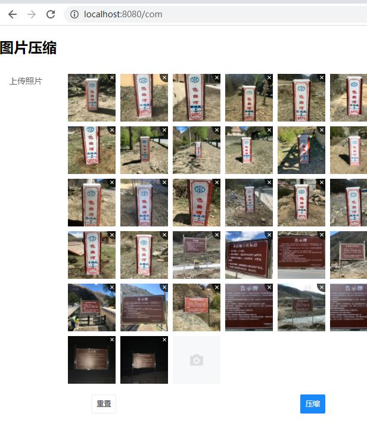
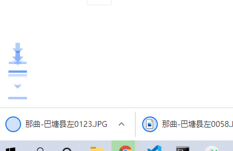
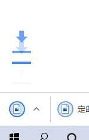
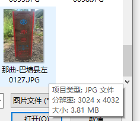
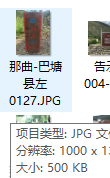

<p align="center">
    <a href="https://npmjs.com/package/npm"></a>
    <a href="https://npmjs.com/package/vue"></a>
    <a href="https://jestjs.io"></a>
</p>
# compress-image

- 图片压缩：使用 vue+vant 进行页面搭建，
- 使用 HTMLCanvasElement+Derived 实现图片压缩，
- 使用 file-saver 进行图片下载
- 插件参考[stackoverflow](https://stackoverflow.com/questions/14672746/how-to-compress-an-image-via-javascript-in-the-browser)

## Project setup

```
npm install
```

### Compiles and hot-reloads for development

```
npm run serve
```

### Compiles and minifies for production

```
npm run build
```

### Lints and fixes files

```
npm run lint
```

### Preview

<table>
  <thead>
    <caption>操作流程预览</caption>
  </thead>
  <tbody>
      <tr>
      <td>
        <center>
          
          <div>上传所有要压缩的图片</div>
        </center>
      </td>
          <td>
        <center>
          
          <div>压缩直接下载</div>
        </center>
      </td>
              <td>
        <center>
          
          <div>压缩直接下载</div>
        </center>
      </td>
    </tr>
      <tr>
      <td>
        <center>
          
          <div>未压缩前</div>
        </center>
      </td>
          <td>
        <center>
          
          <div>压缩后的图片</div>
        </center>
      </td>
    </tr>
  </tbody>
</table>

### Customize configuration

See [Configuration Reference](https://cli.vuejs.org/config/).
